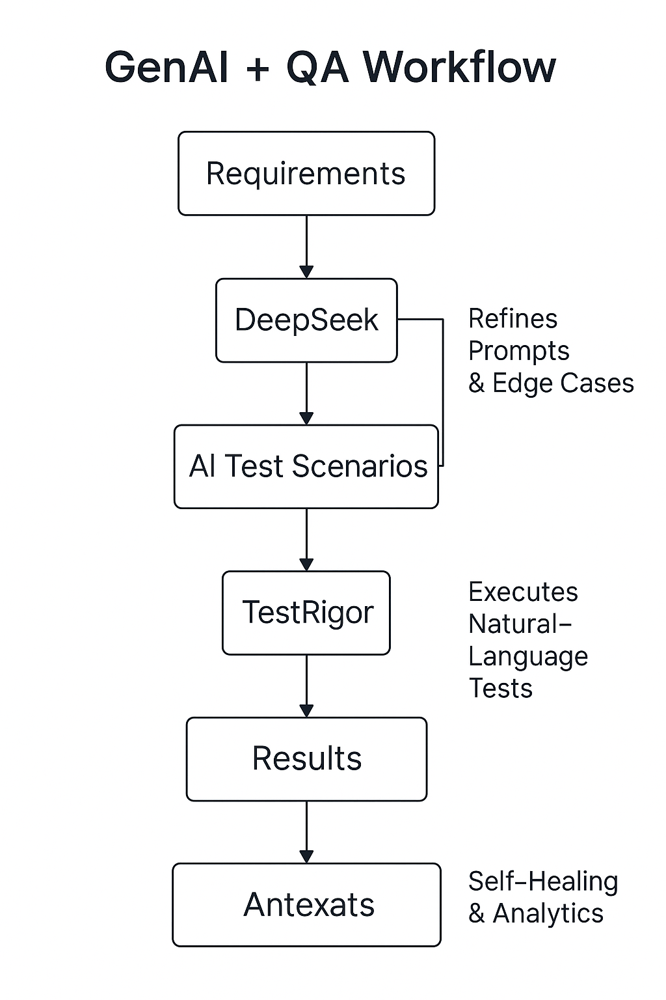

# 🧠 GenAI_Test_Automation

An experimental framework integrating **TestRigor**, **DeepSeek**, and **Ollama** to explore **AI-assisted test automation**.  
Combines natural-language test generation, self-healing scripts, and GenAI models to enhance test coverage and reduce maintenance effort.

---

## 🚀 Project Overview
This project demonstrates how AI models can support Quality Assurance through:
- Automated test case generation from requirements.
- Natural-language test execution with TestRigor.
- Predictive analytics for flaky test detection using DeepSeek.
- Integration with local LLMs (Ollama) for test intent analysis.

---

## ⚙️ Tech Stack
| Tool | Purpose |
|------|----------|
| **TestRigor** | No-code test execution via natural language |
| **DeepSeek** | AI model for test generation and reasoning |
| **Ollama** | Local LLM integration for context-aware validation |
| **VS Code** | IDE for framework and script development |

---

## 🧩 Features
- 🤖 AI-generated test cases  
- 🧠 Model-based test reasoning  
- 🔁 Self-healing automation  
- 📊 Test data generation via LLM prompts  

---
🧩 GenAI + QA Workflow

  

---

📈 Future Work

Integrate with CI/CD pipeline (Jenkins)

Expand DeepSeek model evaluation metrics

Connect with Jira for AI-based defect prediction
---
👩‍💻 Author

Aicha Moustatia — QA Automation Engineer | AI in Testing | Java, Selenium, TestNG, Cucumber
📎 GitHub Profile

